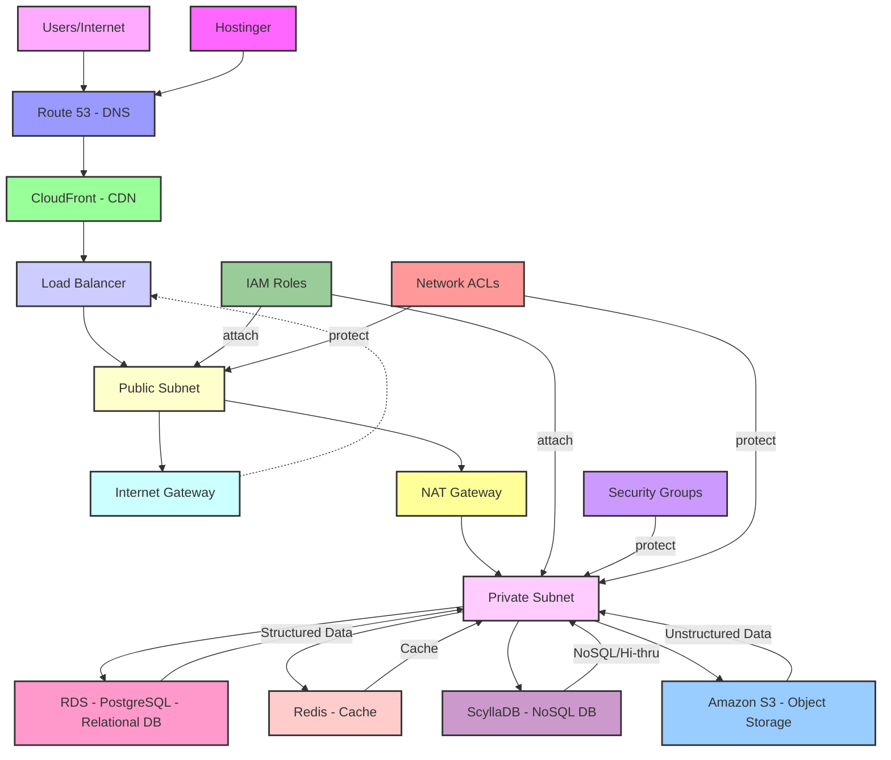

#  Cloud Infra Design 30K feet | Documentation

---

## Author Information

| Last Updated On | Version | Author       | Level           | Reviewer   |
|-----------------|---------|--------------|-----------------|------------|
|  19/08/2025   | V1.0    | Nitin Sharma| Pre Review | Komal Jaiswal     |
|     | V1.0    | Nitin Sharma| L0              | Rajkumar |
|     |         | Nitin Sharma| L1              | Rahul Gupta |
|     |         | Nitin Sharma| L2              | Deepak Nishad |

---

## Table of Contents

* [Introduction](#introduction)
* [Pre-Requisite](#pre-requisite)
* [System Development Approach](#system-development-approach)
* [30,000-Foot Details](#30000-foot-details)
* [Infra Diagram](#infra-diagram)
* [FAQs](#faqs)
* [Conclusion](#conclusion)
* [Contact Information](#contact-information)
* [References](#references)

---

## Introduction

This document provides a high-level overview of our cloud infrastructure design. It is intended for stakeholders who need to understand the architectural philosophy and key components without getting bogged down in implementation details. 

---

## Pre-requisite

**Cloud Computing Concepts:** Familiarity with IaaS, PaaS, and SaaS models.

**Networking Fundamentals:** Knowledge of VPCs, subnets, gateways, Load Balancer and DNS.

**Security Principles:** Awareness of firewalls, Security Group,NACL, IAM roles, and encryption.

**Application Architecture:** Basic knowledge of microservices and monolithic architectures.

---

## System Development Approach

Our approach to cloud infrastructure design is driven by three core principles:

| Approach | Description |
|-----------|------------|
| **Infrastructure as Code (IaC)** | We use tools like Terraform or CloudFormation to manage our infrastructure, ensuring consistency, repeatability, and version control.|
| **DevOps Methodology** | We integrate development and operations teams to automate the software delivery lifecycle, enabling faster and more reliable deployments.|
| **Well-Architected Framework** | We align our design with the five pillars of the AWS Well-Architected Framework (or similar frameworks from other providers): Operational Excellence, Security, Reliability, Performance Efficiency, and Cost Optimization.|

---

## 30,000-Foot Details

Our cloud infrastructure is designed to be a multi-tier, multi-region architecture. Key components include:

Virtual Private Cloud (VPC): A logically isolated virtual network where our resources reside. It is segmented into public and private subnets.

**Storage: We leverage a combination of services.**

Object Storage (Amazon S3): For unstructured data like logs, backups, and media files.

Relational Database Service (RDS): For structured transactional data. Here we are using PostgreSQL. 

Cache management: We are using Redis for cache management.

NoSQL Database : For high-throughput, low-latency applications. Here we are using Scylldb.

Networking & Content Delivery: We use Load Balancers to distribute traffic, Content Delivery Networks (CDN) like CloudFront to cache content closer to users, and Hostinger &Route 53 (DNS) to manage domain routing.

Security: Security is a core focus, implemented at every layer through Identity and Access Management (IAM) roles, Security Groups, and Network Access Control Lists (NACLs). All data is encrypted at rest and in transit.

---

## Infra Diagram

---

## FAQs

| Question | Answer |
|----------|---------|
|**Why did we choose a multi-region architecture?**|A multi-region design ensures high availability and disaster recovery. If one region experiences a complete outage, our services can fail over to another region, minimizing downtime and data loss.|
|**What's the difference between a public and private subnet?**|A public subnet contains resources that need to be accessible from the internet (e.g., a web server). A private subnet contains resources that should not be directly exposed to the internet, such as databases and application servers.|
|**How is our data secured?**|We use a multi-layered security approach. This includes encryption at rest and in transit, strict IAM policies to control access, and Security Groups/NACLs to act as virtual firewalls at the instance and subnet levels.|
|**How do we handle traffic spikes?**|We use Load Balancers and auto-scaling groups to automatically distribute incoming traffic and provision additional compute resources (e.g., EKS pods or EC2 instances) when demand increases, ensuring consistent performance.|

---

## Conclusion

This high-level design provides a robust, scalable, and secure foundation for our applications. By adhering to IaC and DevOps principles and leveraging cloud-native services, we have built an environment that is both resilient and easy to manage.

---

## Contact Information

| Name         | Email address                       |
|--------------|------------------------------------|
| Nitin Sharma | [nitin.sharma.snaatak@mygurukulam.co](mailto:nitin.sharma.snaatak@mygurukulam.co) |

---

## References

| Description | Links  |
|-------------|--------|
|Cloud Infra document |[Link](https://www.atatus.com/glossary/cloud-infrastructure/)|
|Infra Diagram|[Link](https://www.mermaidchart.com/)|

---
