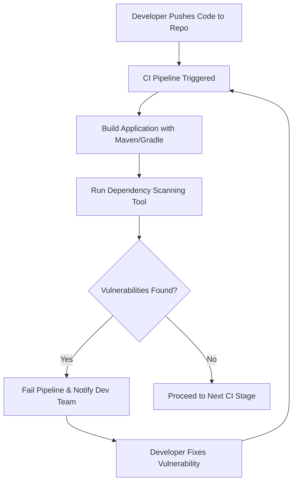

# Java CI Checks | Dependency Scanning

---

## Table of Contents
1. [Introduction](#1-introduction)  
2. [What is Dependency Scanning?](#2-what-is-dependency-scanning)  
3. [Why Perform Dependency Scanning?](#3-why-perform-dependency-scanning)  
4. [Workflow Diagram](#4-workflow-diagram)  
5. [Different Tools for Java Dependency Scanning](#5-different-tools-for-java-dependency-scanning)  
6. [Comparison of Tools](#6-tool-comparison)  
7. [Advantages](#7-advantages)  
8. [Dependency Scanning POC](#8-dependency-scanning-poc)  
9. [Best Practices](#9-best-practices)  
10. [Recommendations & Conclusion](#10-recommendations--conclusion)  
11. [Contact Information](#11-contact-information)  
12. [References](#12-reference)  

---

## 1. Introduction
Dependency scanning is a critical step in the Continuous Integration (CI) process that checks for known vulnerabilities in external libraries and frameworks used by Java application. By integrating dependency scanning into the CI pipeline, development teams can detect and mitigate security risks early in the software lifecycle.

---

## 2. What is Dependency Scanning?
Dependency scanning is the process of automatically checking project dependencies (e.g., Maven, Gradle libraries) for known vulnerabilities, outdated versions, and licensing issues. This ensures that applications remain secure and compliant.

---

## 3. Why Perform Dependency Scanning?

| **Reason**                | **Description**                                                            |
| ------------------------- | -------------------------------------------------------------------------- |
| **Early Detection**       | Identifies vulnerabilities before deployment to prevent insecure releases. |
| **Security Compliance**   | Ensures adherence to industry standards (e.g., OWASP, ISO 27001).          |
| **Risk Mitigation**       | Minimizes attack surface by monitoring third-party packages.               |
| **Continuous Monitoring** | Tracks and detects vulnerabilities as new CVEs are published.              |
| **Cost Reduction**        | Resolving issues early reduces costs compared to post-release remediation. |

---

## 4. Workflow Diagram

## 5. Different Tools for Java Dependency Scanning

| Tool                  | Description                                | Integration                   |
| ------------------------------ | -------------------------------------------------------------------------------------------------------------- | ------------------------------------------------------------------- |
| **OWASP Dependency-Check**     | Finds security issues in the libraries of project uses by matching them with known problems (CVE database).  | Run from command line, use in Maven/Gradle, or add to Jenkins.      |
| **Snyk**                       | Cloud-based tool that checks your project’s open-source libraries for risks and also gives advice to fix them. | Run in command line, integrate with pull requests, or add to CI/CD. |
| **Sonatype Nexus**             | Manages project libraries and also checks them for security issues.                                            | Works with Maven/Gradle and CI/CD pipelines.                        |
| **Mend (WhiteSource)**         | Paid tool that scans your libraries, even while the app is running, and reports issues.                        | Add to CI/CD pipelines or directly to repositories.                 |
| **GitLab Dependency Scanning** | Built-in tool in GitLab that automatically checks for library vulnerabilities when you use GitLab CI/CD.       | Works directly in GitLab CI/CD.                                     |

## 6. Tool Comparison

| Tool                   | Cost / License | Use | Vulnerability Info | Pros                   | Cons       |
| ---------------------- | -------------- | --------------- | -------------------------------- | -------------------------------------- | ----------------------------------- |
| **OWASP Dependency-Check** | Free & Open Source | Easy, but needs setup | NVD (National Vulnerability Database) | Free to use, widely adopted            | Setup can be manual, fewer integrations |
| **Snyk**               | Freemium (Free + Paid) | Very easy, user-friendly | Uses many sources | Nice dashboard, can auto-fix issues via PRs | Free version has limits             |
| **Nexus IQ**           | Commercial (Paid) | Medium (works best with Maven/Gradle) | Sonatype’s own DB | Very good for Java projects (Maven/Gradle) | No free version                     |
| **WhiteSource**        | Commercial (Paid) | Easy            | Many databases combined       | Strong in license compliance checking | Expensive                          |
| **GitLab Dependency Scanning** | Free (basic) / Paid (advanced) | Easy (built into GitLab) | Uses multiple sources | Works smoothly if you use GitLab CI/CD | Only works in GitLab                |

## 7. Advantages
- **Automated Vulnerability Detection:** Scans all dependencies on every build or PR, providing fast feedback.
- **Comprehensive Coverage:** Checks nested dependencies, not just direct ones.
- **Integration:** Embeds in CI/CD pipelines with minimal configuration.
- **Customizable:** Exclude files, set severity thresholds, suppress false positives.
- **Actionable Reporting:** Categorizes by severity, CVSS score, and recommends fixes.

## 8. Dependency Scanning POC

Refer to this [link](https://github.com/Snaatak-Cloudops-Crew/documentation/blob/SCRUM-165-deepak/Applications/CI-Design/GoLang-CI-Checks/Dependency-Scanning/POC/README.md) for **"Step-by-Step Instructions"** for integrating OWASP Dependency-Check in Java CI workflows.

---

## 9. Best Practices

| **Best Practice**                        | **Description**                                                                                            |
| ---------------------------------------- | ---------------------------------------------------------------------------------------------------------- |
| Automate Scans in CI/CD                  | Run dependency scans automatically on every commit/merge to catch vulnerabilities early.                   |
| Regularly Update Scanning Tools          | Keep scanners up to date to detect the latest CVEs and vulnerabilities.                                    |
| Set Severity Thresholds                  | Configure pipeline to fail only when vulnerabilities above a set severity (e.g., High/Critical) are found. |
| Maintain Vulnerability Management Policy | Establish a clear policy for handling, triaging, and remediating vulnerabilities.                          |
| Integrate with Ticketing Systems         | Link scanning results to tools like Jira, ServiceNow, or GitLab issues for tracking.                       |
| Use Multiple Scanning Tools              | Increase accuracy by combining different scanners (e.g., OWASP Dependency-Check + Snyk).                   |
| Review Dependency Updates Manually       | Manually validate dependency upgrades to avoid introducing unstable packages.                              |

## 10. Recommendations & Conclusion

Dependency scanning is an important step in keeping **Java projects** secure and compliant when using **CI/CD pipelines**.
Use a combination of OWASP Dependency-Check (for cost efficiency) and Snyk (for ease of use and automation). Keep the tools updated and integrate scanning into every pipeline run.

## 11. Contact Information

| Name           | Email address                           |
|----------------|-----------------------------------------|
| Meenu Chauhan  | meenu.chauhan.snaatak@mygurukulam.co    |

---

## 12. Reference
| Reference                        | Link                                                                                                                                                             |
| -------------------------------- | ---------------------------------------------------------------------------------------------------------------------------------------------------------------- |
| Java Depdendency Tools | [visit](https://finitestate.io/blog/best-java-scanner)                                                                                         |
|  Java Project Scanning    | [visit](https://medium.com/@giannakopoulosj/sonarqube-owasp-dependency-check-for-java-7431b9620d6c)                       |

---
