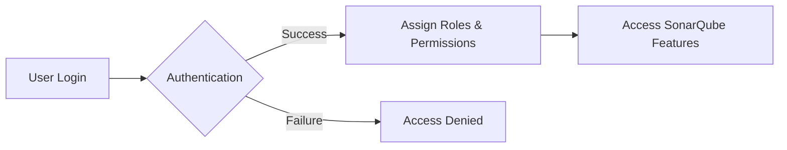

# SonarQube Authentication & Authorization

## Author Information

| Created by      | Created on         | Version  | Last updated On   | Pre Reviewer | L0 Reviewer | L1 Reviewer | L2 Reviewer |
|-----------------|--------------------|----------|-------------------|--------------|-------------|-------------|-------------|
| Meenu Chauhan   | 20-08-2025         | V 1.0    | -                 | Siddarth/Sahil| -           | -           | -           |

---

## Table of Contents

1. [Introduction](#introduction)
2. [What is SonarQube Auth?](#what-is-sonarqube-auth)
3. [Why Authentication & Authorization?](#why-authentication--authorization)
4. [Authentication Workflow Diagram](#authentication-workflow-diagram)
5. [Different Authentication Types](#different-authentication-types)
6. [Comparison Table](#comparison-table)
7. [Best Practices](#best-practices)
8. [Conclusion](#conclusion)
9. [Contact Information](#contact-information)
10. [References](#references)

---

## Introduction
This document provides a comprehensive overview of Authentication (Authn) and Authorization (Authz) in SonarQube. 
It explains what Authn and Authz are, why they are important, the different types available, workflow, best practices, and recommendations.
The goal is to help teams implement secure access control, manage user permissions effectively, and ensure compliance with organizational security policies.

---

## What Are Authentication & Authorization?
**Authentication** Authentication refers to the process of verifying user identity through various methods like username/password, LDAP, SAML, or OAuth. It answers the question "Who are you?"

**Authorization** Granting privileges or access levels to users/groups after successful authentication. Controls who can view dashboards, perform analyses, manage projects i.e  what authenticated users can do within SonarQube. It answers the question "What can you do?"

---
## Why Authentication & Authorization?

| Reason             | Description                                                         |
| ------------------ | ------------------------------------------------------------------- |
| **Protect Code**   | Prevent unauthorized access to sensitive code and analysis reports. |
| **Compliance**     | Ensure adherence to security policies and regulations.              |
| **Access Control** | Fine-grained permissions for users and projects.                    |
| **Auditability**   | Track who did what for accountability and traceability.             |
| **Reduce Risk**    | Minimize chances of accidental or malicious changes.                |

---
## Workflow Diagram

---
## Different Types of Authentication & Authorization in SonarQube

### Authentication Types in SonarQube

| Type                                   | Description                                                          |
| -------------------------------------- | -------------------------------------------------------------------- |
| **Built-in Users**                     | Native SonarQube accounts for login.                                 |
| **LDAP / Active Directory**            | Integrates with corporate directories for centralized login.         |
| **SSO (OAuth2, SAML, OpenID Connect)** | Single Sign-On using external providers like GitHub, GitLab, Google. |
| **Token-based**                        | Access via generated tokens, mainly for API or CI/CD pipelines.      |

### Authorization Types in SonarQube

| Type                    | Description                                                               |
| ----------------------- | ------------------------------------------------------------------------- |
| **Global Permissions**  | Administer system-wide settings like Administer System, Execute Analysis. |
| **Project Permissions** | Control user roles and access per project (Admin, User, Viewer).          |
| **Groups & Roles**      | Assign permissions collectively to multiple users for easier management.  |
| **Default Permissions** | Predefined access rights applied to newly created projects.               |

---

## Comparison Table

| Feature                 | Built-in  | LDAP/AD      | SSO (OAuth2/SAML) | Token-based |
| ----------------------- | --------- | ------------ | ----------------- | ----------- |
| **Identity Management** | SonarQube | External     | External          | SonarQube   |
| **Single Sign-On**      | No        | No           | Yes               | No          |
| **API Access**          | No        | No           | No                | Yes         |
| **Role Mapping**        | Manual    | Automatic    | Automatic         | Manual      |
| **Password Management** | SonarQube | Corporate AD | Corporate SSO     | N/A         |

---

## Best Practice

| Practice                  | Description                                                       |
| ------------------------- | ----------------------------------------------------------------- |
| **Use SSO / LDAP**        | Prefer enterprise SSO or LDAP for centralized user management.    |
| **Avoid Shared Accounts** | Ensure each user has an individual account with proper roles.     |
| **Least Privilege**       | Grant only necessary permissions to reduce security risks.        |
| **Regular Audits**        | Periodically review user access and project permissions.          |
| **Token-based Access**    | Use tokens for CI/CD pipelines instead of passwords.              |
| **Enable Audit Logging**  | Track authentication and authorization events for accountability. |

---

## Conclusion
Authentication and Authorization in SonarQube are critical for securing code, managing access, and maintaining compliance.
Enterprise setups should prefer LDAP/SSO for centralized management, apply least privilege principles, and use token-based access for 
automation to ensure security and operational efficiency.

---

## Contact Information

| Name           | Email address                           |
|----------------|-----------------------------------------|
| Meenu Chauhan  | meenu.chauhan.snaatak@mygurukulam.co    |

---

## Reference
| Reference                        | Link                                                                                                                                                             |
| -------------------------------- | ---------------------------------------------------------------------------------------------------------------------------------------------------------------- |
| SonarQube Official Documentation | [visit](https://docs.sonarqube.org/latest/)                                                                                         |
| SonarQube Security Overview      | [visit](https://docs.sonarqube.org/latest/instance-administration/security/)                       |
| Authentication & Authorization   | [visit](https://www.okta.com/identity-101/authentication-vs-authorization/) |

---
